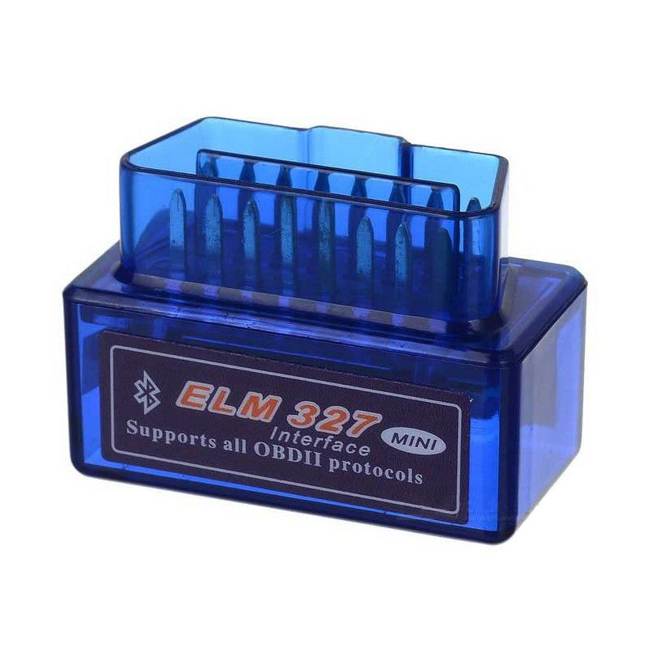

# Raspberry Pi 3 Based Car PC

This project appeared as a result of some personal researches in the field of existing car PCs, car engines diagnostic technologies and protocols nad is a preparation step for another car engines related project.

### The Goals
The main goal was to create a low cost, easy to setup and reliable car PC.
The resulting PC should be able to perform the following functions:

- Media player (audio)
- Car diagnostics
- Car information storage
- Map navigator
- Should not use any proprietary software

### Hardware Prerequisites
Minimal hardware prerequisites are the following:

- Car with an OBD2 diagnostics socket 
- Raspberry Pi 3
- Touchscreen for RPi3
- USB audio card for RPi3
- GPS module for RPi3
- 5V car power adapter for RPi3
- USB flashdrive

### OS
Operating system used on Raspberry Pi 3 device is [Raspbian](https://www.raspberrypi.org/downloads/raspbian/).

### The Code
Entire code is written in Python3. It makes use of the following libraries:
- [kivy](https://kivy.org/#home) - a GUI framework
- [pybluez](https://pybluez.github.io/) - bluetooth resources access library
- [pyalsaaudio](http://larsimmisch.github.io/pyalsaaudio/) - [Advanced Linux Sound Architecture](https://www.alsa-project.org/wiki/Main_Page) python library
- [tinytag](https://github.com/devsnd/tinytag) - audio file metadata reading library

### OBD2 Connection
I'm using an ELM327 OBD2 bluetooth device to connect to the car OBD2 bus.

Still, any bluetooth, wifi or USB OBD2 device may be used with slight code (or even configuration only) changes.

### Screenshots
Some screenshots of process and real device may be found in documentation [images](documentation/images/) folder.

### Contribution
Any contribution is welcome. Please, contact me if you need any information.